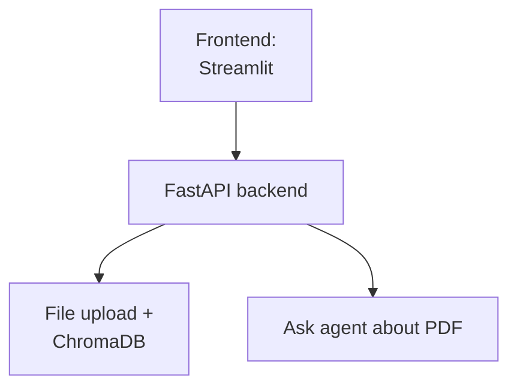

# PDF Assistant 

Full Stack App for PDF RAG purposes, specially for Medical Purposes

---

## Description

1. This app is built with:
- FastAPI for the backend
- An embedding model from Cohere and a ChromaDB database
- A RAG agent using Gemini for consuming and consulting the ChromaDB database
- Frontend built with Streamlit connected to the FastAPI API that communicates with the RAG agent and the uploading process


2. This App allows:

- Upload a PDF and, with an embedding model, store it in a ChromaDB database
- Ask the assistant about the uploaded document in a chatbot-esque way

--- 

## Architecture



---

## How to use 

1. Create a Python venv and install dependencies

```bash
cd RAG_FastAPI #on the root of the project
python3 -m venv .pdf_extractor
source .pdf_extractor/bin/activate
pip3 install -r requirements.txt
```
2. Create a .env file with necessary API keys

```env
COHERE-API-KEY = "Your Cohere API key goes here"
GOOGLE-API-KEY = "Your Google API key goes here"
```

3. Run both the backend and the frontend
- frontend:
  ```bash
  cd src/frontend
  streamlit run app.py
  ```
- backend:
  ```bash
  cd src/backend/api
  uvicorn main:app --reload --port 8080
  ```
  or also
  ```bash
  cd RAG_FastAPI #on the root of the project
  PYTHONPATH=src uvicorn backend.api.main:app --port 8080
  ```

--- 
## Structure

- 📁 **src**/
  - 📁 **backend**/
    - 📁 **api**/
      - 🐍 main.py
    - 📁 **rag**/
      - 🐍 __init__.py
      - 🤖 agent.py
      - 🛠️ db_connector.py
      - 📝 prompt.py
      - 🧰 tools.py
  - 📁 **chromadb**/ (Vector Store for retrieval, the file is processed by the embedding)
  - 📁 **frontend**/
    - 🖥️ app.py
    - 💬 chat.py
    - 📁 **sidebar**/
      - 🐍 __init__.py
      - 📋 sidebar.py
      - ⬆️ uploader.py
  - 📁 **uploaded**/ (Where the file while be also uploaded and save it without any processing)
